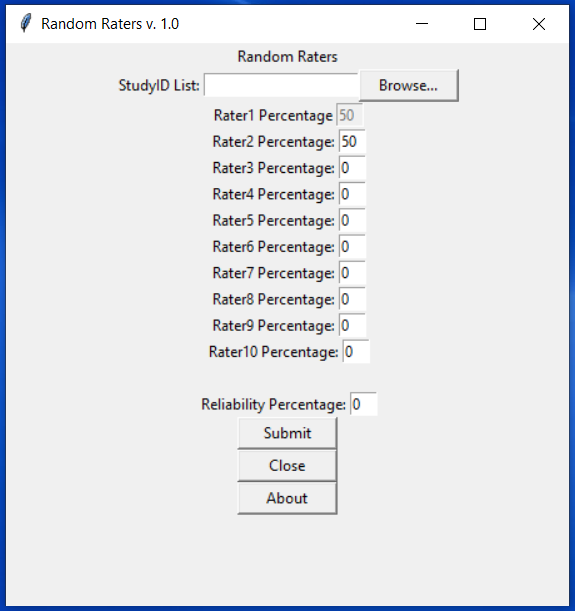

# RandomRaters
Assign up to 10 raters each a random list of StudyIDs based on a large list of unknown size. 

Each list should be unique and not repeat any StudyIDs.

# What I Learned
* Use a "callback" function to update Rater1's percentage when any of the other raters percentages change.
* Add in reliability StudyIDs if needed across all raters. This allows for inter-rater reliabilty.
* Continue to randomly assign IDs till the end of the file even if the number of IDs in each list is uneven.
* Make sure that an ID is unique across all lists.

